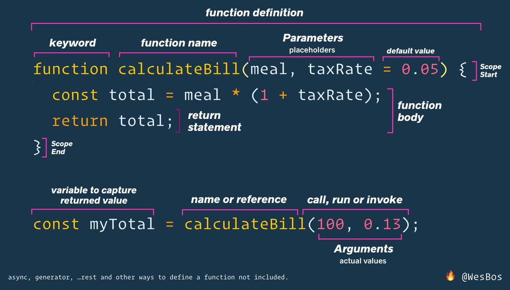

# Beginner JavaScript!

[Beginner JavaScript](https://BeginnerJavaScript.com) A course by Wes Bos

## Index

### [Variables](https://github.com/nabrus/beginner-javascript/blob/master/playground/variables.html)
*  `var`, `let`, and `const`

### [JS Data Types](https://github.com/nabrus/beginner-javascript/blob/master/playground/types.js)
*  String
*  Number
*  Object
*  `null` and `undefined`
*  Boolean
    * Equality: difference between `=` vs. `==` vs. `===`
*  Symbol 

### Functions

*  [Built In](https://github.com/nabrus/beginner-javascript/blob/master/playground/functions.html)
*  [Custom](https://github.com/nabrus/beginner-javascript/blob/master/playground/custom-functions/cf.js)
     *  Basic function structure
     *  Parameters and Arguments
     *  Default Parameters

### Function Definition Diagram

*  [Declaring Functions](https://github.com/nabrus/beginner-javascript/blob/master/playground/custom-functions/ways-to-make-a-function.js)
     *  Function Declaration (Function Statement, Function Definition)
     *  Function Expression
        *  Anonymous Function
     *  Arrow Function
     *  IIFE (Immediately Invoked Function Expression)
     *  Method
     *  Callback Function

### [Debugging](https://github.com/nabrus/beginner-javascript/blob/master/exercises/16%20-%20Debugging/debugging.js)

*  Console Methods
*  Call Stack
*  Web Console Helpers - check out [MDN](https://developer.mozilla.org/en-US/docs/Tools/Web_Console/Helpers) for more info.
*  Breakpoints
     *  Debugger Statement
     *  Setting breakpoints using browsers dev tools
*  Network Requests

### [Scope](https://github.com/nabrus/beginner-javascript/blob/master/playground/scope.js)

*  Global Scope
     *  Global Variable
*  Function Scope
*  Block Scope
*  Lexical Scope

### [Hoisting](https://github.com/nabrus/beginner-javascript/blob/master/playground/hoisting.js)

*  Hoisting of function and variable declarations

### [Closures](https://github.com/nabrus/beginner-javascript/blob/master/playground/closures.html)

*  High level overview of a *closure*

### The DOM

*  [Intro to the document](https://github.com/nabrus/beginner-javascript/blob/master/exercises/20%20-%20The%20DOM/the-dom.js)
     *  Selecting Elements - `document.querySelector()` & `document.querySelectorAll()`
          *  by class `('.className')` or element `('p')` examples
     *  Nodes vs. Elements
     *  Interacting with classes of an HTML element using `element.classList`
          *  `element.classList.add("newClass");`
          *  `element.classList.remove("class");`
          *  `element.classList.toggle("class");`
     *  `console.dir()` displays a list of the properties of the specified JavaScript object
     *  Getters & Setters - using properties and/or attributes to "get" or "set"
          *  Properties:
               *  `.textContent` vs. `.innerText`
               *  `.innerHTML` & `.outerHTML`
          *  Attributes:
               * `.id`, `.alt`, `.naturalWidth`, `.width`
     *  HTML Data Attributes
          *  Prefix `data-*` to an attribute name
          *  Accessing the data stored in `data-*` attributes using the `dataset` property
     *  Methods
          *  `insertAdjacentText(position, text)` insert text adjacent to an element 
          *  `setAttribute()`
          *  `getAttribute()`
*  [Creating HTML](https://github.com/nabrus/beginner-javascript/blob/master/exercises/20%20-%20The%20DOM/creating.js)
     *  `document.createElement()` - creates HTML elements specified by tagName
     *  Methods for adding the created elements to the document
          *  `node.appendChild()` 
          *  `node.insertBefore()` 
          *  `element.append()` 
          *  `element.insertAdjacentElement(position, element)`
*  [Creating HTML from strings](https://github.com/nabrus/beginner-javascript/blob/master/exercises/20%20-%20The%20DOM/creating-with-strings.js)
     *  Use backticks ` `` `
     *  `element.innerHTML` property gets or sets the HTML or XML markup contained within the element
     *  Generating and accessing DOM elements from a string using:
          *  `Document.createRange()` method to create a *range*
          *  `createContextualFragment()` method available on the Range object
*  [Traversing and Removing Nodes](https://github.com/nabrus/beginner-javascript/blob/master/exercises/20%20-%20The%20DOM/traversing.js)
     *  Review of Nodes vs Elements
     *  Using Node and Element properties to traverse the DOM by position:
          *  `Element.children`
          *  `Element.firstElementChild`
          *  `Node.childNodes`
          *  `Node.firstChild`
          *  And more...
     *  Removing nodes/elements
          *  `element.remove(element)`
          *  `node.removeChild(child)`
*  "Cardio" -  An exercise to practice more examples of things covered in this section.
     *  [My Approach](https://github.com/nabrus/beginner-javascript/blob/master/exercises/20%20-%20The%20DOM/DOM-Cardio2.js)
     *  [Wes' Approach](https://github.com/nabrus/beginner-javascript/blob/master/exercises/20%20-%20The%20DOM/DOM-Cardio-FINISHED.js)

### Events

*  [Intro to Event Listeners](https://github.com/nabrus/beginner-javascript/blob/master/exercises/29%20-%20Events/events.js)
     *  `element.addEventListener(event, function, options)`
     *  `element.removeEventListener(event, callbackFunction)`
     *  Listen on multiple items
          *  Intro to `forEach()` method
*  [Event Object](https://github.com/nabrus/beginner-javascript/blob/master/exercises/29%20-%20Events/events2.js)
     *  `event.target` vs `event.currentTarget`
     *  Propagation
          *  Event Bubbling and Event Capturing
          *  `stopPropagation()`
     *  Overview on the `this` keyword 
*  [Preventing Default Actions](https://github.com/nabrus/beginner-javascript/blob/master/exercises/29%20-%20Events/forms.js)
     *  Examples of using `event.preventDefault()` on form events
          *  `click`
          *  `submit`
          *  `keyup` & `keydown`
          *  `focus` & `blur`
     *  Accessibility Notes
          *  Do not use links as buttons and vice versa
          *  Allowing keyboard use for `click` events
               *  `event.key`

### Exercises Part 1

[Etch-A-Sketch](https://github.com/nabrus/beginner-javascript/blob/master/exercises/33%20-%20Etch-a-Sketch/etch-a-sketch.js)
     *  Canvas API
     *  Options Object
     *  Destructuring
     *  `switch` Statement
     *  `addEventListener(type, listener, options)`
          *  `animationend` event
          *  `once` option

